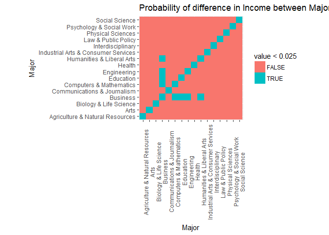

AssociationBtwCollegeMajorvxIncome
================
Prafull
October 26, 2018

#### data

``` r
library(collegeIncome)
data("college")
head(college, 5)
```

    ##   rank major_code                                     major major_category
    ## 1    1       2419                     Petroleum Engineering    Engineering
    ## 2    2       2416            Mining And Mineral Engineering    Engineering
    ## 3    3       2415                 Metallurgical Engineering    Engineering
    ## 4    4       2417 Naval Architecture And Marine Engineering    Engineering
    ## 5    5       2405                      Chemical Engineering    Engineering
    ##   total sample_size perc_women p25th median  p75th   perc_men
    ## 1  2339          36  0.9109326 25000  40000  50000 0.08906743
    ## 2   756           7  0.5154064 26000  37000  40000 0.48459355
    ## 3   856           3  0.5942076 26700  45000  60000 0.40579235
    ## 4  1258          16  0.6521298 26000  35000  45000 0.34787018
    ## 5 32260         289  0.4179248 31500  62000 109000 0.58207520
    ##   perc_employed perc_employed_fulltime perc_employed_parttime
    ## 1     0.9115044              0.9206524              0.1774785
    ## 2     0.7980501              0.7110092              0.3623853
    ## 3     0.7871943              0.8833498              0.3387257
    ## 4     0.8465608              0.9366337              0.1673267
    ## 5     0.8515625              0.8086363              0.4020061
    ##   perc_employed_fulltime_yearround perc_unemployed perc_college_jobs
    ## 1                        0.7704431      0.08849558         0.6702970
    ## 2                        0.7093101      0.20194986         0.3867764
    ## 3                        0.7738366      0.21280567         0.7289116
    ## 4                        0.6527853      0.15343915         0.2460902
    ## 5                        0.6852821      0.14843750         0.5867515
    ##   perc_non_college_jobs perc_low_wage_jobs
    ## 1             0.1821782         0.05544554
    ## 2             0.5158761         0.21560172
    ## 3             0.1759983         0.03014828
    ## 4             0.4107636         0.04323827
    ## 5             0.3860437         0.11801062

#### Summary of Data

``` r
summary(college)
```

    ##       rank       major_code      major           major_category    
    ##  Min.   :  1   Min.   :1100   Length:173         Length:173        
    ##  1st Qu.: 44   1st Qu.:2403   Class :character   Class :character  
    ##  Median : 87   Median :3608   Mode  :character   Mode  :character  
    ##  Mean   : 87   Mean   :3880                                        
    ##  3rd Qu.:130   3rd Qu.:5503                                        
    ##  Max.   :173   Max.   :6403                                        
    ##                                                                    
    ##      total         sample_size       perc_women         p25th      
    ##  Min.   :   124   Min.   :   2.0   Min.   :0.0000   Min.   :18500  
    ##  1st Qu.:  4361   1st Qu.:  39.0   1st Qu.:0.3397   1st Qu.:24000  
    ##  Median : 15058   Median : 130.0   Median :0.5357   Median :27000  
    ##  Mean   : 39168   Mean   : 356.1   Mean   :0.5226   Mean   :29501  
    ##  3rd Qu.: 38844   3rd Qu.: 338.0   3rd Qu.:0.7020   3rd Qu.:33000  
    ##  Max.   :393735   Max.   :4212.0   Max.   :0.9690   Max.   :95000  
    ##                                                                    
    ##      median           p75th           perc_men       perc_employed   
    ##  Min.   : 22000   Min.   : 22000   Min.   :0.03105   Min.   :0.0000  
    ##  1st Qu.: 33000   1st Qu.: 42000   1st Qu.:0.29798   1st Qu.:0.7477  
    ##  Median : 36000   Median : 47000   Median :0.46429   Median :0.8028  
    ##  Mean   : 40151   Mean   : 51494   Mean   :0.47745   Mean   :0.7886  
    ##  3rd Qu.: 45000   3rd Qu.: 60000   3rd Qu.:0.66033   3rd Qu.:0.8410  
    ##  Max.   :110000   Max.   :125000   Max.   :1.00000   Max.   :0.9562  
    ##                                                                      
    ##  perc_employed_fulltime perc_employed_parttime
    ##  Min.   :0.5743         Min.   :0.0000        
    ##  1st Qu.:0.7741         1st Qu.:0.2090        
    ##  Median :0.8319         Median :0.2862        
    ##  Mean   :   Inf         Mean   :0.2874        
    ##  3rd Qu.:0.8974         3rd Qu.:0.3623        
    ##  Max.   :   Inf         Max.   :0.5518        
    ##                         NA's   :1             
    ##  perc_employed_fulltime_yearround perc_unemployed   perc_college_jobs
    ##  Min.   :0.5857                   Min.   :0.04383   Min.   :0.0633   
    ##  1st Qu.:0.7009                   1st Qu.:0.15899   1st Qu.:0.2974   
    ##  Median :0.7484                   Median :0.19723   Median :0.4160   
    ##  Mean   :0.7476                   Mean   :0.21140   Mean   :0.4478   
    ##  3rd Qu.:0.7896                   3rd Qu.:0.25229   3rd Qu.:0.6170   
    ##  Max.   :1.0000                   Max.   :1.00000   Max.   :0.8383   
    ##                                                     NA's   :1        
    ##  perc_non_college_jobs perc_low_wage_jobs
    ##  Min.   :0.08278       Min.   :0.00000   
    ##  1st Qu.:0.27995       1st Qu.:0.06957   
    ##  Median :0.42020       Median :0.10857   
    ##  Mean   :0.41498       Mean   :0.11481   
    ##  3rd Qu.:0.52756       3rd Qu.:0.15353   
    ##  Max.   :0.85364       Max.   :0.36566   
    ##  NA's   :1             NA's   :1

``` r
str(college)
```

    ## 'data.frame':    173 obs. of  19 variables:
    ##  $ rank                            : int  1 2 3 4 5 6 7 8 9 10 ...
    ##  $ major_code                      : int  2419 2416 2415 2417 2405 2418 6202 5001 2414 2408 ...
    ##  $ major                           : chr  "Petroleum Engineering" "Mining And Mineral Engineering" "Metallurgical Engineering" "Naval Architecture And Marine Engineering" ...
    ##  $ major_category                  : chr  "Engineering" "Engineering" "Engineering" "Engineering" ...
    ##  $ total                           : int  2339 756 856 1258 32260 2573 3777 1792 91227 81527 ...
    ##  $ sample_size                     : int  36 7 3 16 289 17 51 10 1029 631 ...
    ##  $ perc_women                      : num  0.911 0.515 0.594 0.652 0.418 ...
    ##  $ p25th                           : num  25000 26000 26700 26000 31500 23000 32500 37900 29200 23000 ...
    ##  $ median                          : num  40000 37000 45000 35000 62000 44700 45000 57000 36000 32200 ...
    ##  $ p75th                           : num  50000 40000 60000 45000 109000 50000 58000 67000 46000 47100 ...
    ##  $ perc_men                        : num  0.0891 0.4846 0.4058 0.3479 0.5821 ...
    ##  $ perc_employed                   : num  0.912 0.798 0.787 0.847 0.852 ...
    ##  $ perc_employed_fulltime          : num  0.921 0.711 0.883 0.937 0.809 ...
    ##  $ perc_employed_parttime          : num  0.177 0.362 0.339 0.167 0.402 ...
    ##  $ perc_employed_fulltime_yearround: num  0.77 0.709 0.774 0.653 0.685 ...
    ##  $ perc_unemployed                 : num  0.0885 0.2019 0.2128 0.1534 0.1484 ...
    ##  $ perc_college_jobs               : num  0.67 0.387 0.729 0.246 0.587 ...
    ##  $ perc_non_college_jobs           : num  0.182 0.516 0.176 0.411 0.386 ...
    ##  $ perc_low_wage_jobs              : num  0.0554 0.2156 0.0301 0.0432 0.118 ...

#### Data Manipulation

``` r
library(matahari)
dance_start(value = FALSE, contents = FALSE)
college$major_code = as.factor(college$major_code)
#factoring variables
college$major = as.factor(college$major)
college$major_category <- as.factor(college$major_category)
```

##### fiting linear model for reference variable to be Arts

``` r
#Ordering major_category in increasing order of alphabets
college = college[order(college$major_category),]
#summary of linear model using Arts as refrence levelby changing reference level to Arts
major_category_ref <- relevel(college$major_category, "Arts")
fit <- lm(data = college , median ~ major_category_ref)
summary(fit)$coef
```

    ##                                                         Estimate
    ## (Intercept)                                            38050.000
    ## major_category_refAgriculture & Natural Resources       5450.000
    ## major_category_refBiology & Life Science                5814.286
    ## major_category_refBusiness                             11103.846
    ## major_category_refCommunications & Journalism           3950.000
    ## major_category_refComputers & Mathematics              -3331.818
    ## major_category_refEducation                             -112.500
    ## major_category_refEngineering                           2343.103
    ## major_category_refHealth                                2266.667
    ## major_category_refHumanities & Liberal Arts            -2883.333
    ## major_category_refIndustrial Arts & Consumer Services   2378.571
    ## major_category_refInterdisciplinary                   -10550.000
    ## major_category_refLaw & Public Policy                   -250.000
    ## major_category_refPhysical Sciences                     2350.000
    ## major_category_refPsychology & Social Work              1838.889
    ## major_category_refSocial Science                        1016.667
    ##                                                       Std. Error
    ## (Intercept)                                             4014.658
    ## major_category_refAgriculture & Natural Resources       5386.228
    ## major_category_refBiology & Life Science                5032.640
    ## major_category_refBusiness                              5102.541
    ## major_category_refCommunications & Journalism           6953.591
    ## major_category_refComputers & Mathematics               5276.294
    ## major_category_refEducation                             4916.931
    ## major_category_refEngineering                           4534.719
    ## major_category_refHealth                                5182.901
    ## major_category_refHumanities & Liberal Arts             4971.264
    ## major_category_refIndustrial Arts & Consumer Services   5876.857
    ## major_category_refInterdisciplinary                    12043.973
    ## major_category_refLaw & Public Policy                   6473.441
    ## major_category_refPhysical Sciences                     5386.228
    ## major_category_refPsychology & Social Work              5517.619
    ## major_category_refSocial Science                        5517.619
    ##                                                           t value
    ## (Intercept)                                            9.47776950
    ## major_category_refAgriculture & Natural Resources      1.01183974
    ## major_category_refBiology & Life Science               1.15531531
    ## major_category_refBusiness                             2.17614057
    ## major_category_refCommunications & Journalism          0.56805181
    ## major_category_refComputers & Mathematics             -0.63146941
    ## major_category_refEducation                           -0.02288012
    ## major_category_refEngineering                          0.51670312
    ## major_category_refHealth                               0.43733553
    ## major_category_refHumanities & Liberal Arts           -0.58000007
    ## major_category_refIndustrial Arts & Consumer Services  0.40473529
    ## major_category_refInterdisciplinary                   -0.87595680
    ## major_category_refLaw & Public Policy                 -0.03861934
    ## major_category_refPhysical Sciences                    0.43629787
    ## major_category_refPsychology & Social Work             0.33327579
    ## major_category_refSocial Science                       0.18425822
    ##                                                           Pr(>|t|)
    ## (Intercept)                                           3.919976e-17
    ## major_category_refAgriculture & Natural Resources     3.131715e-01
    ## major_category_refBiology & Life Science              2.497166e-01
    ## major_category_refBusiness                            3.103954e-02
    ## major_category_refCommunications & Journalism         5.708113e-01
    ## major_category_refComputers & Mathematics             5.286520e-01
    ## major_category_refEducation                           9.817749e-01
    ## major_category_refEngineering                         6.060905e-01
    ## major_category_refHealth                              6.624690e-01
    ## major_category_refHumanities & Liberal Arts           5.627460e-01
    ## major_category_refIndustrial Arts & Consumer Services 6.862230e-01
    ## major_category_refInterdisciplinary                   3.823917e-01
    ## major_category_refLaw & Public Policy                 9.692429e-01
    ## major_category_refPhysical Sciences                   6.632200e-01
    ## major_category_refPsychology & Social Work            7.393708e-01
    ## major_category_refSocial Science                      8.540487e-01

#### Storing Probability values into matrix

``` r
#Creating Matrix in which all  p value of summary function will be store for each major_category against each other category
A <- matrix( , 16, 16)
for (i in 1:16){
    major_category_ref <- relevel(college$major_category, as.character(unique(college$major_category)[i]))
    fit <- lm(median ~ major_category_ref,  data = college)
    tmp <- summary(fit)$coef[,4]
    tmp1 <- tmp[1:i]
    tmp1 <- c(tmp1[-1], tmp1[1])
    A[,i] = c(tmp1, tmp[-(1:i)])
}
```

``` r
#reshaping matrix to dataframe and converting datframe from wide foramt to long format because we can use ggplot for long format data using melt function
library(reshape)
```

    ## Warning: package 'reshape' was built under R version 3.5.1

``` r
library(ggplot2)

B <- data.frame(A)
names(B) <- unique(college$major_category)
B$major <- unique(college$major_category)
Bmelt <- melt(B)
```

    ## Using major as id variables

``` r
head(Bmelt)
```

    ##                             major                        variable
    ## 1 Agriculture & Natural Resources Agriculture & Natural Resources
    ## 2                            Arts Agriculture & Natural Resources
    ## 3          Biology & Life Science Agriculture & Natural Resources
    ## 4                        Business Agriculture & Natural Resources
    ## 5     Communications & Journalism Agriculture & Natural Resources
    ## 6         Computers & Mathematics Agriculture & Natural Resources
    ##          value
    ## 1 2.873928e-24
    ## 2 3.131715e-01
    ## 3 9.383379e-01
    ## 4 2.383031e-01
    ## 5 8.236023e-01
    ## 6 7.866520e-02

#### Exploratroy data Anlaysis

``` r
g <- ggplot(Bmelt, aes(x = variable, y = major, fill = value))
g <- g + geom_tile()
g <- g + theme(axis.text.x = element_text(angle = 90)) + ylab("Major") + xlab("Major")
g <- g + ggtitle("Probability of difference in Income between Majors")
g <- g + coord_fixed(1)
g
```

(proj_files/figure-markdown_github/unnamed-chunk-7-1.png)

``` r
#ggplot to distinguish  values whose p value will be less than 0.25 and greater than 0.25 
g <- ggplot(Bmelt, aes(x = variable, y = major, fill = value < 0.025))
g <- g + geom_tile()
g <- g + theme(axis.text.x = element_text(angle = 90)) + ylab("Major") + xlab("Major")
g <- g + ggtitle("Probability of difference in Income between Majors")
g <- g + coord_fixed(1)
g
```



``` r
#Take business as reference level and find the values for remaing category 
major_category_ref <- relevel(college$major_category, "Business")
fit <- lm(median ~ major_category_ref, data = college)
summary(fit)$coef
```

    ##                                                         Estimate
    ## (Intercept)                                            49153.846
    ## major_category_refAgriculture & Natural Resources      -5653.846
    ## major_category_refArts                                -11103.846
    ## major_category_refBiology & Life Science               -5289.560
    ## major_category_refCommunications & Journalism          -7153.846
    ## major_category_refComputers & Mathematics             -14435.664
    ## major_category_refEducation                           -11216.346
    ## major_category_refEngineering                          -8760.743
    ## major_category_refHealth                               -8837.179
    ## major_category_refHumanities & Liberal Arts           -13987.179
    ## major_category_refIndustrial Arts & Consumer Services  -8725.275
    ## major_category_refInterdisciplinary                   -21653.846
    ## major_category_refLaw & Public Policy                 -11353.846
    ## major_category_refPhysical Sciences                    -8753.846
    ## major_category_refPsychology & Social Work             -9264.957
    ## major_category_refSocial Science                      -10087.179
    ##                                                       Std. Error   t value
    ## (Intercept)                                             3149.357 15.607584
    ## major_category_refAgriculture & Natural Resources       4776.236 -1.183745
    ## major_category_refArts                                  5102.541 -2.176141
    ## major_category_refBiology & Life Science                4373.606 -1.209428
    ## major_category_refCommunications & Journalism           6492.565 -1.101852
    ## major_category_refComputers & Mathematics               4651.908 -3.103171
    ## major_category_refEducation                             4239.951 -2.645395
    ## major_category_refEngineering                           3790.072 -2.311498
    ## major_category_refHealth                                4545.705 -1.944073
    ## major_category_refHumanities & Liberal Arts             4302.840 -3.250685
    ## major_category_refIndustrial Arts & Consumer Services   5323.384 -1.639047
    ## major_category_refInterdisciplinary                    11783.813 -1.837592
    ## major_category_refLaw & Public Policy                   5975.484 -1.900071
    ## major_category_refPhysical Sciences                     4776.236 -1.832792
    ## major_category_refPsychology & Social Work              4923.931 -1.881618
    ## major_category_refSocial Science                        4923.931 -2.048603
    ##                                                           Pr(>|t|)
    ## (Intercept)                                           9.444322e-34
    ## major_category_refAgriculture & Natural Resources     2.383031e-01
    ## major_category_refArts                                3.103954e-02
    ## major_category_refBiology & Life Science              2.283166e-01
    ## major_category_refCommunications & Journalism         2.722123e-01
    ## major_category_refComputers & Mathematics             2.271210e-03
    ## major_category_refEducation                           8.989341e-03
    ## major_category_refEngineering                         2.210557e-02
    ## major_category_refHealth                              5.367450e-02
    ## major_category_refHumanities & Liberal Arts           1.408831e-03
    ## major_category_refIndustrial Arts & Consumer Services 1.032059e-01
    ## major_category_refInterdisciplinary                   6.801278e-02
    ## major_category_refLaw & Public Policy                 5.925698e-02
    ## major_category_refPhysical Sciences                   6.872781e-02
    ## major_category_refPsychology & Social Work            6.173891e-02
    ## major_category_refSocial Science                      4.216615e-02

``` r
business_diff <- summary(fit)$coef[-1,]
business_diff[order(business_diff[,4])[1:5],]
```

    ##                                               Estimate Std. Error
    ## major_category_refHumanities & Liberal Arts -13987.179   4302.840
    ## major_category_refComputers & Mathematics   -14435.664   4651.908
    ## major_category_refEducation                 -11216.346   4239.951
    ## major_category_refEngineering                -8760.743   3790.072
    ## major_category_refArts                      -11103.846   5102.541
    ##                                               t value    Pr(>|t|)
    ## major_category_refHumanities & Liberal Arts -3.250685 0.001408831
    ## major_category_refComputers & Mathematics   -3.103171 0.002271210
    ## major_category_refEducation                 -2.645395 0.008989341
    ## major_category_refEngineering               -2.311498 0.022105573
    ## major_category_refArts                      -2.176141 0.031039539

``` r
dance_save("C:/Users/Mahe/Desktop/material/Data_Science/Rcodes/college_major_analysis.rds")
```
